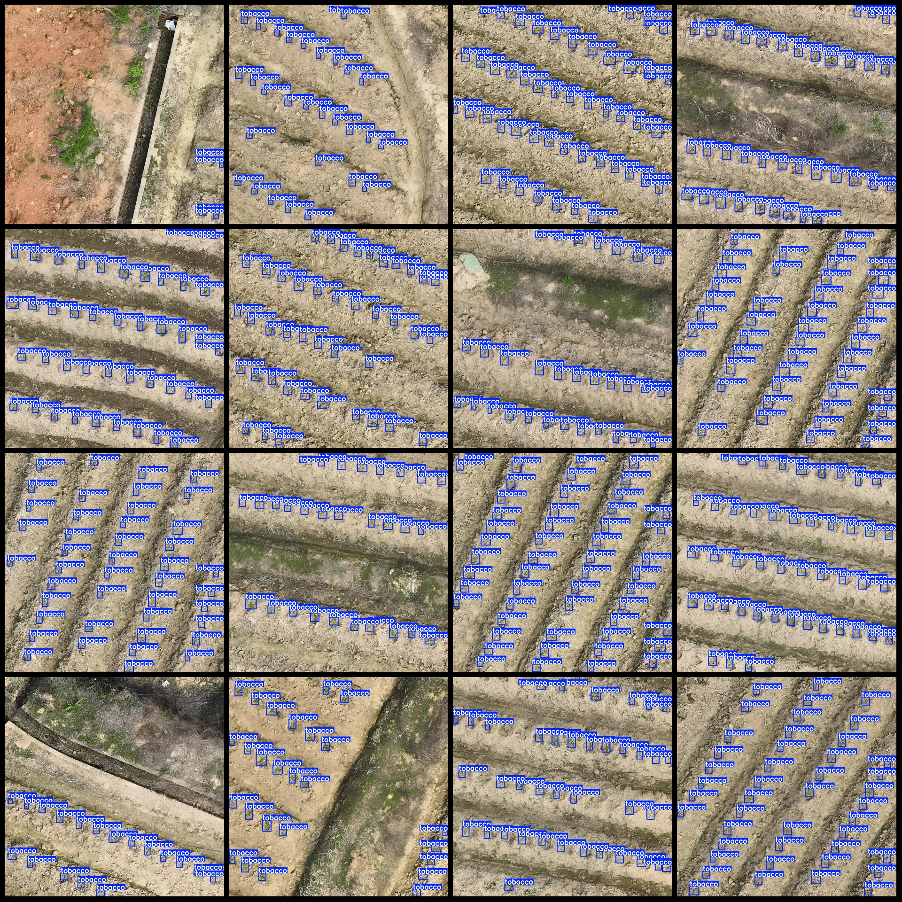
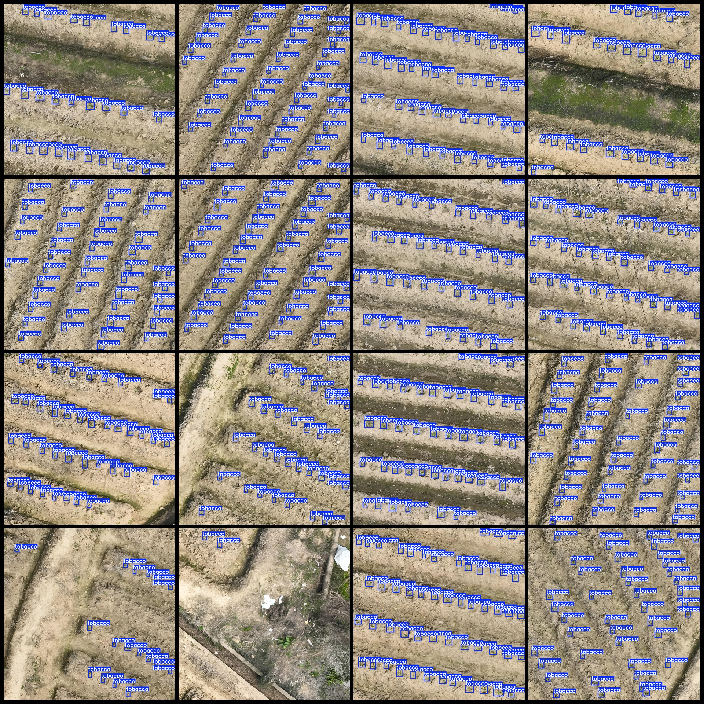
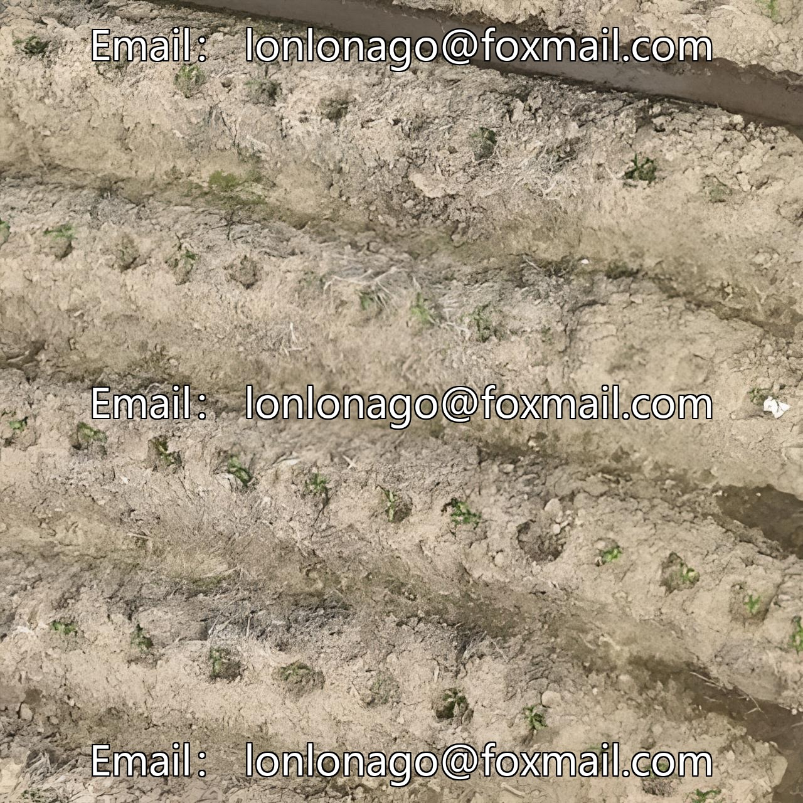

# Drone Perspective Tobacco Plant Leaf Sprouting Rate Detection Dataset VOC+YOLO

Note: The plant sprout can not be clearly seen with the naked eye, please refer to the images below.

Dataset format: Pascal VOC format + YOLO format (the txt file does not contain the split path, only contains the jpeg images as well as the corresponding VOC format xml files and YOLO format txt 
files)

Number of images (jpg file count): 540

Number of annotations (xml file count): 540

Number of annotations (txt file count): 540

Number of annotation categories: 1

Annotation category name: ["tobacco"]

Number of bounding box per category:  
tobacco bounding box = 19430  
Total bounding boxes = 19430  
Number of pictures each category occupies:  
tobacco pictures = 540  
Image resolution: 1280x1280  
Annotation tool used: labelImg  
Annotation rule: draw bounding boxes for each category  
Important note: The dataset does not have been divided into training, validation, and test sets; it needs to be manually divided.

Special declaration: This dataset does not guarantee the accuracy of the trained model or weight files.

Image preview:  
Annotation example:  
Original image:

## Images

Here is a pay link on Stripe ( https://buy.stripe.com/3cs8yP7sY87d0vu9AB ). Please contact me lonlonago@foxmail.com after funding $89, and I will send you a complete data files , thank you!

